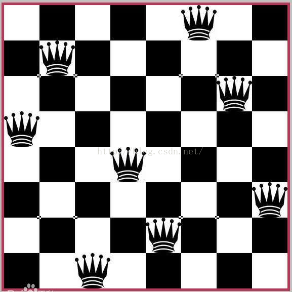

# 递归

·
递归是消耗空间 因为递归需要开辟栈  空间换时间
递归（思想）算法应用-牺牲空间换取时间
·

一.递归与回溯的概念

1.1递归和回溯定义

程序调用自身的编程技巧称为递归（ recursion）。

递归做为一种算法在程序设计语言中广泛应用。 一个过程或函数在其定义或说明中有直接或间接调用自身的一种方法，
它通常把一个大型复杂的问题层层转化为一个与原问题相似的规模较小的问题来求解，
递归策略只需少量的程序就可描述出解题过程所需要的多次重复计算，大大地减少了程序的代码量。

回溯算法实际上一个类似枚举的搜索尝试过程，主要是在搜索尝试过程中寻找问题的解，当发现已不满足求解条件时，就“回溯”返回，尝试别的路径。

回溯法是一种选优搜索法，按选优条件向前搜索，以达到目标。但当探索到某一步时，发现原先选择并不优或达不到目标，
就退回一步重新选择，这种走不通就退回再走的技术为回溯法


`回溯是一种算法思想，它是用递归实现的。`回溯的过程类似于穷举法，但回溯有“剪枝”功能，即自我判断过程。
例如有求和问题，
给定有 7 个元素的组合 [1, 2, 3, 4, 5, 6, 7]，求加和为 7 的子集。
累加计算中，选择 1+2+3+4 时，判断得到结果为 10 大于 7，那么后面的 5, 6, 7 就没有必要计算了。
这种方法属于搜索过程中的优化，即“剪枝”功能。

## 递归介绍以及用递归解决迷宫回溯、八皇后问题

> 简单的说，递归就是方法自己调用自己，每次传入不同的变量。递归有助于编程者解决复杂问题，让代码变得简洁。


小型迷宫实现---迷宫算法（递归回溯法）


栈常常被用来实现编程语言，使用栈实现递归即为一例。


当你接触复杂业务或者数据量大的业务 就肯定会用到数据结构和算法了


八皇后问题，是一个古老而著名的问题，是回溯算法的典型案例。
该问题是国际西洋棋棋手马克斯·贝瑟尔于 1848 年提出:在 8×8 格的国际象棋上摆放八个皇后，
使其不能互相攻击，即:任意两个皇后都不能处于同一行、 同一列或同一斜线上，问有多少种摆法(92)。


## 我的理解

如果判断什么时候用递归

递归可以解决`回溯算法`

回溯法是一种选优搜索法，按选优条件向前搜索，以达到目标。但当探索到某一步时，发现原先选择并不优或达不到目标，
就退回一步重新选择，这种走不通就退回再走的技术为回溯法  -- 回溯算法最重要的一点就是如何回到原处（`我的理解是回到原处就用判断，假如这个判断不成立就会回到原处了`）

多刷刷就知道了


不符合就回到原处/原位置


循环和递归 好像可以互相取代的感觉

回溯法：即试探法，系统的搜索所有解的方法。具体思想：从一条路往前走，能进则进，不能进则退出来，换条路再走。解决八皇后问题的经典算法。



要记得从整体看一个程序的运行

比如

```java
  //从第一列开始放值，然后判断是否和本行本列本斜线有冲突，如果OK，就进入下一行的逻辑
        for (int i = 0; i < max; i++) {
            array[n] = i;
            if (judge(n)) {
                check(n + 1);
            }
        }
```
不看递归的 这个会执行max次 再从细的看递归  递归是属于细节里面去看的


还有不用考虑那个第一个皇后放在第八个位置 这种例子 原因是因为八个皇后性质一样 是放在第一个就是第一个又不是像(ABCDEF...)这种性质不同的
所以考虑列的情况就行了


想想八皇后棋盘有多少种排序（考虑冲突） 8的8次方？ 我觉得应该是

时间复杂度
空间复杂度